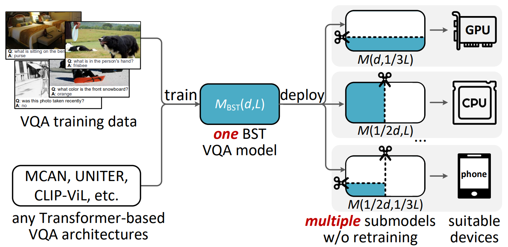

## Introduction

This is code for our [paper](https://ieeexplore.ieee.org/abstract/document/10075477) "Bilaterally Slimmable Transformer for Elastic and Efficient Visual Question Answering". Bilaterally Slimmable Transformer (BST) is a general framework that can be seamlessly integrated into arbitrary Transformer-based VQA models to train a single model once and obtain various slimmed submodels of different widths and depths. In this repo, we integrate the proposed BST framework with the MCAN model and train it on VQA-v2 and GQA datasets. The code is adopted from the [OpenVQA](https://github.com/MILVLG/openvqa) repo. Many thanks to the authors of this repo!

<p align="center">
	
</p>


## Installation

### Environment 

Please follow the openvqa documentation to install the [required environment](https://openvqa.readthedocs.io/en/latest/basic/install.html#hardware-software-setup).

### Dataset 

- Image Features

Please follow the openvqa documentation to prepare the image features for [VQA-v2](https://openvqa.readthedocs.io/en/latest/basic/install.html#vqa-v2) and [GQA](https://openvqa.readthedocs.io/en/latest/basic/install.html#gqa) datasets.

- QA Annotations

Please download our re-splited QA annotations for [VQA-v2](https://awma1-my.sharepoint.com/:u:/g/personal/yuz_l0_tn/EXjbjynrARdMhoPlBpbt7YABAUDMUXFJDE35X-Zb9rgv0w?download=1) and [GQA](https://awma1-my.sharepoint.com/:u:/g/personal/yuz_l0_tn/EQVTkcVtPi1AtFoIXPA2bvEBB0D5JUsCFfe60VpdLPqN_A?download=1) datasets and unzip them to the specified directory.

```
# for VQA-v2 QA annotations
$ unzip -d ./data/vqa/raw/ vqa-data.zip

# for GQA QA annotations
$ unzip -d ./data/gqa/raw/ gqa-data.zip
```

### Teacher Model Checkpoint

Please download the [VQA-v2](https://awma1-my.sharepoint.com/:u:/g/personal/yuz_l0_tn/EUxPX_bCXTBMh8SMo4lhczUBL1SekpcJwSMT2XYZ0deFOQ?download=1) and [GQA](https://awma1-my.sharepoint.com/:u:/g/personal/yuz_l0_tn/ESlXt_CudNdArAHr0mtdn6gBjAtU3sT0o3ngweuAZiDSeA?download=1) teacher model weights for BST training and put them in `. /ckpts/teacher_model_weights/` directory.

### Re-check

After preparing the datasets and teacher model weights, the project directory structure should look like this:

```
|-- data
	|-- vqa
	|  |-- feats
	|  |  |-- train2014
	|  |  |-- val2014
	|  |  |-- test2015
	|  |-- raw
	|-- gqa
	|  |-- feats
	|  |  |-- gqa-frcn
	|  |-- raw
|-- ckpts
	|-- teacher_model_weights
	|  |-- vqav2_teacher_epoch14.pkl
	|  |-- gqa_teacher_epoch11.pkl
```

**Note that if you only want to run experiments on one specific dataset, you can focus on the setup for that and skip the rest. For example, if you just want to run experiments on VQA-v2 dataset, you can only prepare the VQA-v2 dataset and vqa teacher model weights.**

## Getting Started

### Training

The following script will start training a `mcan_bst` model:

```
# train on VQA-v2 dataset
$ python3 run.py --RUN='train' --DATASET='vqa' --SPLIT='train+vg' --GPU=<str> --VERSION=<str>

# train on GQA dataset
$ python3 run.py --RUN='train' --DATASET='gqa' --SPLIT='train+val' --GPU=<str> --VERSION=<str>
```

- `--GPU`, e.g., `--GPU='0'`, to train the model on specified GPU device.
- `--VERSION`, e.g., `--VERSION='your_version_name'`, to assign a name for your this experiment.

All checkpoint files will be saved to `ckpts/ckpt_<VERSION>/epoch<EPOCH_NUMBER>.pkl` and the training log file will be placed at `results/log/log_run_<VERSION>.txt`.

### Testing

For VQA-v2, if you want to evaluated on the test-dev sets, please run the following script to generate the result file first:

```
$ python3 run.py --RUN='test' --MODEL='mcan_bst' --DATASET='vqa' --CKPT_V='your_vqa_version_name' --GPU='0' --CKPT_E=<int> --WIDTH=<str> --DEPTH=<str>
```

- `--CKPT_E`, e.g., `--CKPT_E=15`, to specify the epoch number (usually the last is the best).
- `--WIDTH`, e.g., `--WIDTH='1'`, to specify the submodel width for inference, the candidate width set is `{'1/4', '1/2', '3/4', '1'}`. 
- `--DEPTH`, e.g., `--DEPTH='1'`, to specify the submodel depth for inference, the candidate depth set is `{'1/6', '1/3', '2/3', '1'}`.

If `--WIDTH` or `--DEPTH` is not specified, inference will be performed on all submodels. Finally, result file is saved at: `results/result_test/result_run_<CKPT_V>_<WIDTH>_<DEPTH>_<CKPT_E>.json`, upload it to [VQA Challenge Page](https://eval.ai/web/challenges/challenge-page/830/phases) to get the scores on test-dev set.

For GQA, you can evaluate on local machine directly to get the scores on test-dev set, the script is:

```
$ python3 run.py --RUN='val' --MODEL='mcan_bst' --DATASET='gqa' --CKPT_V='your_gqa_version_name' --GPU='0' --CKPT_E=<int> --WIDTH=<str> --DEPTH=<str>
```

## Model Zoo

We also provide the checkpoint models on the VQA-v2 and GQA datasets to reproduce the following results on `test-dev` using the testing script above.

| model      | VQA-v2 ([ckpt](https://awma1-my.sharepoint.com/:u:/g/personal/yuz_l0_tn/EZasOMzt9nlPkLpw0dgLR_0B-XZPz1ede5uGuckNVGz5iw?download=1)) | GQA ([ckpt](https://awma1-my.sharepoint.com/:u:/g/personal/yuz_l0_tn/ETUhPacQZZRMk3i-8K40kFIBlPn6pqTG1JSn6scg96CIAA?download=1)) |
| :---------- | :-------------: | :----------: |
| MCAN<sub>BST</sub> (D, L) | 71.04 | 58.37 |
| MCAN<sub>BST</sub> (1/2D, L) | 70.48 | 57.78 |
| MCAN<sub>BST</sub> (1/2D, 1/3L) | 69.53 | 57.34 |
| MCAN<sub>BST</sub> (1/4D, 1/3L) | 68.13 | 56.69 |

## License

This project is released under the Apache 2.0 license.

## Citation

If you use this code in your research, please cite our paper:

```
@article{yu2023bst,
  title={Bilaterally Slimmable Transformer for Elastic and Efficient Visual Question Answering}, 
  author={Yu, Zhou and Jin, Zitian and Yu, Jun and Xu, Mingliang and Wang, Hongbo and Fan, Jianping},
  journal={IEEE Transactions on Multimedia}, 
  year={2023}
}
```

